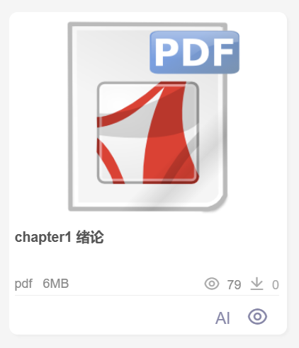
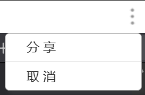
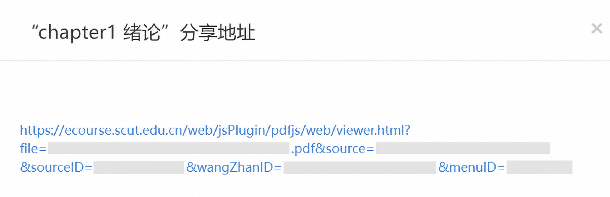

# SCUT Course PDF Downloader

一个用于下载华南理工大学课程中心 PDF 课件的 Chrome 扩展。当前版本支持 PDF 直链，以及地址中包含原始 PDF 的 PDF.js 预览页。

## 安装

扩展不需要 Python、LibreOffice 或本地服务。安装完成后，Chrome 直接从本地目录读取扩展文件。

### 让 Agent 帮你安装

把下面这段话发给能够操作本地文件和终端的 Agent。

```text
请帮我安装这个 Chrome 扩展
https://github.com/Wh1te358/scut-course-pdf-downloader

请把仓库克隆到一个长期保留的本地目录，不要放进临时目录。克隆完成后运行 npm test。如果电脑没有 Node.js，跳过测试即可，扩展本身不依赖 Node.js。

完成后请告诉我 manifest.json 所在目录的绝对路径，并引导我在 Chrome 的 chrome://extensions 页面加载这个目录。不要修改源码，不要读取或输出 GitHub Token。如果仓库权限不足，停下来告诉我需要先登录 GitHub。
```

Agent 可以完成下载、检查文件和运行测试。Chrome 可能要求你亲自点击“加载已解压的扩展程序”，这是浏览器对扩展安装的保护。

### 手动下载到本地

使用 Git 时，在终端运行以下命令。

```bash
git clone https://github.com/Wh1te358/scut-course-pdf-downloader.git
cd scut-course-pdf-downloader
```

不使用 Git 时，打开仓库页面，点击 **Code**，再点击 **Download ZIP**。把 ZIP 解压到一个长期保留的目录。扩展加载后不能随意删除或移动这个目录。

你可以检查目录中是否存在 `manifest.json`、`popup.html` 和 `popup.js`。`manifest.json` 所在目录就是下一步需要交给 Chrome 的目录。

项目自带可选测试。电脑已安装 Node.js 时运行下面的命令。

```bash
npm test
```

看到所有测试通过即可。没有 Node.js 可以跳过，扩展运行时不会调用 npm。

### 加载到 Chrome

1. 在 Chrome 地址栏输入 `chrome://extensions/`。
2. 打开页面右上角的“开发者模式”。
3. 点击“加载已解压的扩展程序”。
4. 选择刚才下载的目录。这个目录中应当直接包含 `manifest.json`。
5. 页面出现 **SCUT Course PDF Downloader** 卡片后，确认扩展已经启用。
6. 如需经常使用，可在 Chrome 工具栏的扩展菜单中把它固定。

以后更新 Git 仓库时，在本地目录运行 `git pull`，随后回到 `chrome://extensions/`，点击扩展卡片上的重新加载按钮。

## 使用

### 适用范围

这个扩展适用于华南理工大学课程中心里的 PDF 课件。目标文件只有 **AI** 和预览按钮，没有下载按钮。



当前版本只处理 PDF。PPT、PPTX、视频和课程主页链接不会被识别。页面本身已经提供正常下载按钮时，直接使用网站的下载功能即可。

### 获取 PDF 预览链接

1. 进入课程中心，打开存放 PDF 课件的文件夹。
2. 点击页面右上角的三个点。
3. 在菜单中点击“分享”。

   

4. 页面会弹出该文件的分享地址。点击这个地址，在浏览器中打开它。

   

5. 等待 PDF 预览页完成加载。浏览器地址栏中的链接通常包含 `viewer.html?file=`，其中的 `file=` 参数保存着原始 PDF 地址。

### 使用扩展下载

1. 保持刚才打开的 PDF 预览页处于当前标签页。
2. 点击 Chrome 工具栏中的 **SCUT Course PDF Downloader**。
3. 复制浏览器地址栏中的完整链接，粘贴到扩展的“PDF 链接”输入框。
4. 点击“识别链接”。
5. 识别成功后，点击“下载 PDF”。
6. 扩展会从当前预览页读取已经加载的 PDF，并开始下载原文件。

下载期间不要切换到其他标签页。扩展需要确认输入的链接与当前打开的 PDF 预览页一致。

### 识别失败时检查

- 输入框中应当是打开分享地址后，浏览器地址栏显示的完整链接。
- 链接中应当同时出现 `viewer.html`、`file=` 和 `.pdf`。
- 当前标签页应当停留在同一个 PDF 预览页。
- PDF 内容尚未显示时，等待页面加载完成后重试。
